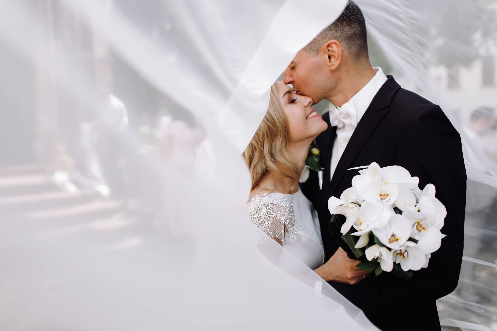

# Casamento: Laura & Pedro 💍

Este é o repositório do site do casamento de Laura e Pedro, criado para compartilhar informações sobre o grande dia, nossa história, galeria de fotos, lista de presentes e permitir que os convidados confirmem sua presença (RSVP).

## 📂 Estrutura do Projeto

```
index.html
css/
    style.css
img/
    casal.png
    moment1.png
    moment2.png
    moment3.png
    moment4.png
    moment5.png
    moment6.png
    noivos.png
js/
    script.js
```

- **`index.html`**: Página principal do site com todas as seções.
- **`css/style.css`**: Arquivo de estilos personalizados para o site.
- **`img/`**: Pasta com imagens utilizadas no site, incluindo fotos dos noivos e momentos especiais.
- **`js/script.js`**: Script JavaScript para funcionalidades como contagem regressiva, formulário de RSVP e modal de galeria.

## 🌟 Funcionalidades

- **Contagem Regressiva**: Mostra o tempo restante até o dia do casamento.
- **Nossa História**: Um resumo emocionante sobre como Laura e Pedro se conheceram.
- **Galeria de Fotos**: Momentos inesquecíveis com modal para visualização ampliada.
- **Lista de Presentes**: Sugestões de presentes, incluindo cotas de lua de mel, Pix e links para lojas online.
- **RSVP**: Formulário para os convidados confirmarem sua presença.

## 🛠️ Tecnologias Utilizadas

- **HTML5**: Estrutura do site.
- **CSS3**: Estilização personalizada com variáveis e responsividade.
- **JavaScript**: Funcionalidades interativas, como contagem regressiva e modal.
- **Bootstrap 5**: Framework CSS para layout responsivo e componentes prontos.
- **Font Awesome**: Ícones para melhorar a experiência visual.
- **Animate.css**: Animações suaves para elementos do site.

## 🚀 Como Usar

1. Clone este repositório:
   ```bash
   git clone https://github.com/seu-usuario/casamento.git
   ```
2. Abra o arquivo `index.html` no navegador para visualizar o site.

## 📸 Pré-visualização



## 📋 To-Do

- [ ] Adicionar integração com backend para salvar confirmações de presença (RSVP).
- [ ] Melhorar a acessibilidade do site.
- [ ] Adicionar mais fotos à galeria.

## 📝 Licença

Este projeto é apenas para uso pessoal e não possui uma licença específica. Sinta-se à vontade para se inspirar, mas lembre-se de respeitar os direitos autorais das imagens e textos.

---

Feito com ❤️ por Laura & Pedro para celebrar o nosso grande dia!
